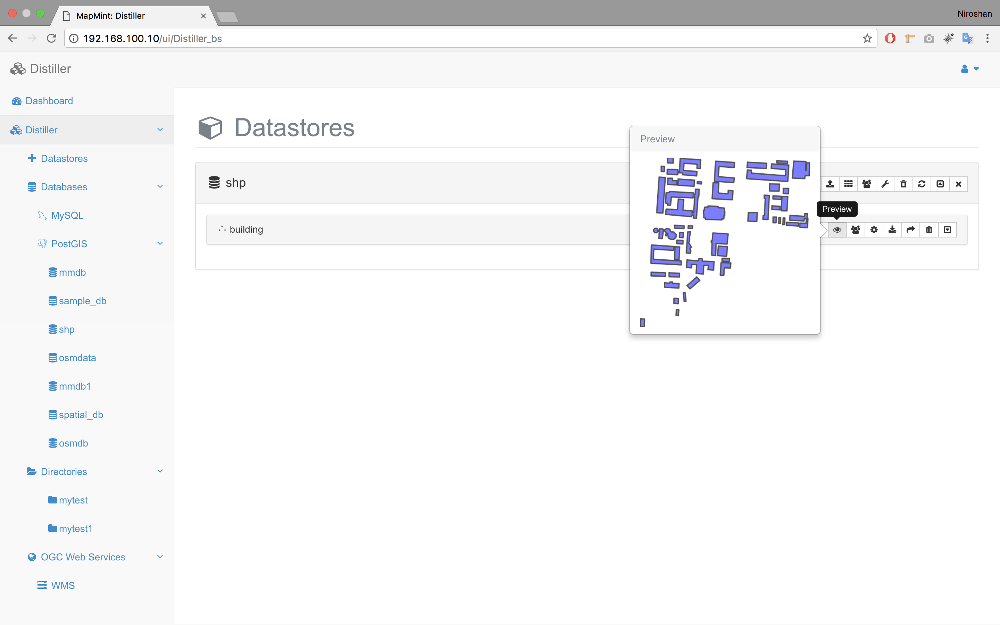
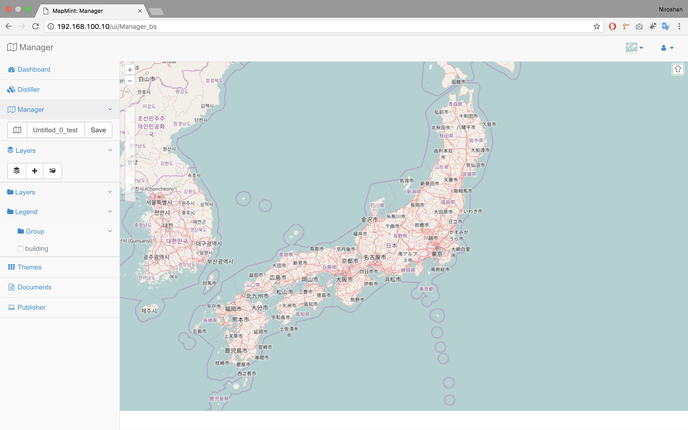
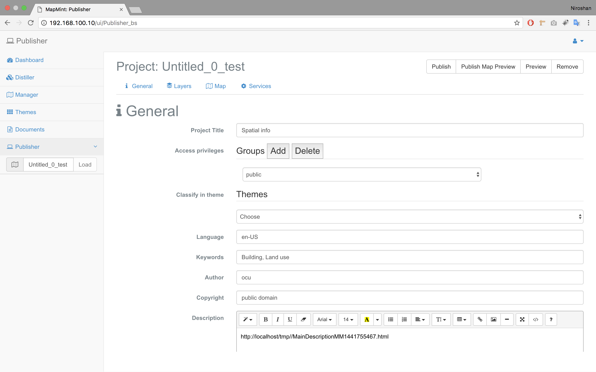
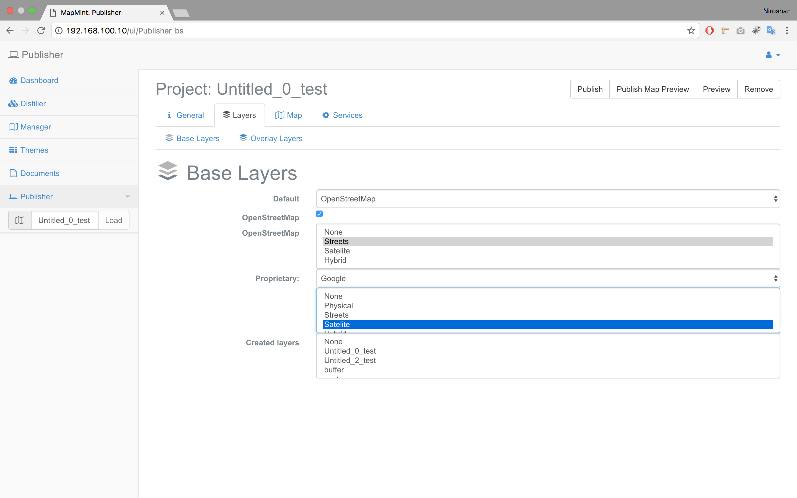
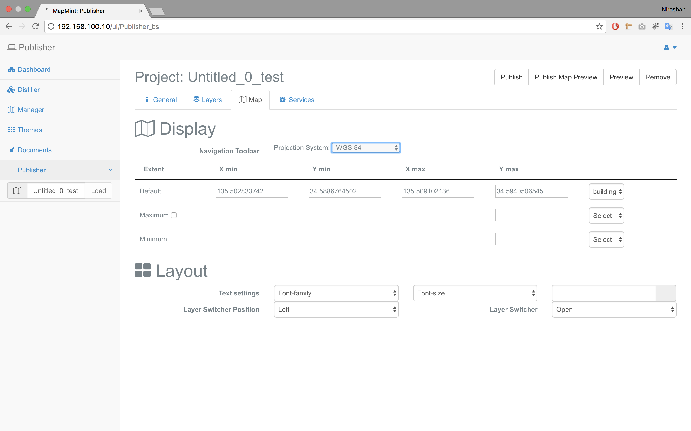
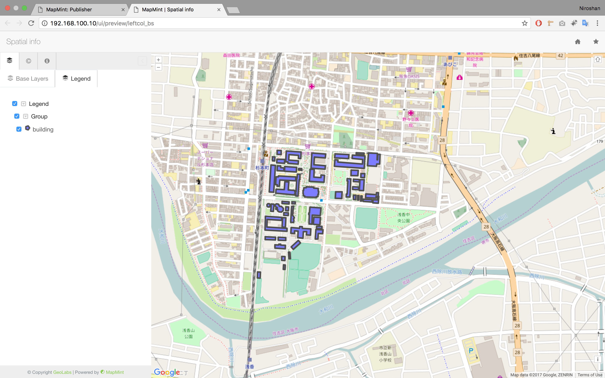

# Publishing and Sharing Maps with MapMint 

## Installation 
You can install mapmint by following the tutorial which is available in [GitHub](http://mapmint.github.io/userguide-fr/en/introduction/installmapmint.html).
There are few things you need to concern when you are installing the mapmint. Here I mentioned the things I concerned when I was installing mapmint in my server. The first thing is about the version of postgres which you are going to use. The version is defined in the [main.yml](https://github.com/mapmint/ansible-roles/blob/master/ubuntu/dependencies/vars/main.yml) file. You can change it before you run the ansible file. Then you need to edit the Libreoffice version to the latest version. It can be identified by running the [loVersion.sh](https://github.com/mapmint/ansible-roles/tree/master/scripts) script. After you indentfied the latest version of LibreOffice you need to changed the existing version which is mentioned in the ubuntu [main.yml](https://github.com/mapmint/ansible-roles/blob/master/ubuntu/dependencies/vars/main.yml) file under lo_version and in the [debian file](https://github.com/mapmint/ansible-roles/blob/master/debian/dependencies/vars/main.yml) as well. Then you can run the ansible and wait until complete the installation. 

## Start 

Then you can access your MapMint instance by using the following URLs. 

 * Access to administrative modules : http://localhost/ui/Dashboard_bs

 * Access to the public interface : http://localhost/ui/public/

Sometime you may get a 404 error, which means page not found. So, you can restart the apache server and try again. 

After that you can load the page again, Sometime you may get an error as shown in below image. 

 

This is occured due to duplicate the users in the database. You can check it in the PostgreSQL, under mmdb databse. You can fid users are under "mm" schema and inside the users table. If you can find many users with the same data you can delete them and keep a one. Then you can refresh the Mapmint page and access to administrative modules. It can be seen as following image. 

 

After successfully complete the installation and access to administrative modules you can start sharing publishing your data.

### Connect with PostGIS

You can simply establish your PostGIS database connection with MapMint by adding the configuration information with Distiller module. 
But, befefore that you have to make some changes in the main configuration file in the mapmint according to your server. You can find your main configuration file ( [main.cfg](main.cfg) ) in your server, in the <b> /usr/lib/cgi-bin/mm/ </b> directory. In the main configuration file you can find that the host defined as myhost.net, It need to be changed according to your host name. You can replce myhost.net with your host name (ex: localhost ). 
Once you done this step, you have to go to the /home/src/mapmint/mapomint-services/vector-tools-src/ direcrory and build the vector tools. (It can be done by using "sudo make" command). If it returns an error as follows 

`g++: error: /home/src/zoo/zoo-project/zoo-kernel/service_yaml.o: No such file or directory`

You can simply remove that line in your Make file and rebuild the vector tools. Now you are ready to connect PostGIS database to mapmint as shown in the below picture. 

Once you successfully add the info you are able to see your layers which are inside the database as follows. 

As you can see here, there is an option to preview your layer in this module. But when you are trying to preview the layer sometime you may not able to preview it. It happened, because your javascript library path is different than you defined in japascript confiduration file. 
You can check the javascript configuration file in <b> /home/src/mapmint/public_map/assets/js </b> directory. Currently the baseUrl is defined as /~djay/progede2/public_map/assets/ , but you have to changed it to <b> /pm/assets </b>. Because all the javascript files are loacated in /assets/js directory. 
Once you done that, you will be able to see your layes with preview option as shown in below picture. 

### Publish your map

After your preview and select your layer you can open it in the Manager as shown in below picture. You can add layers and save it. 

Then you can open the publsiher module. 

Here you can give a title and other theme information to your publishing maps. 

Then you can choose a base layer for instance OpenStreetmap or Google sattelite or streets etc.

Next you have to define the projection system and default layer extend, maximium and minimum extend. 

Likewise you can add all the neccessary information and finally you can publish your map sets with MapMint. 

